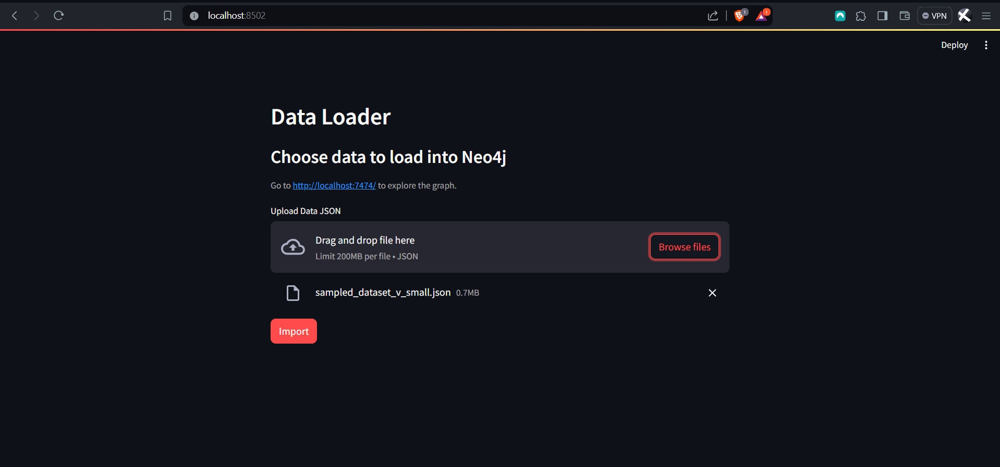
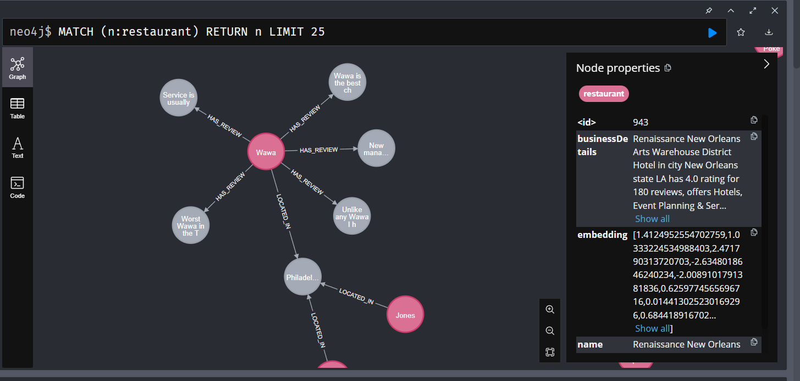
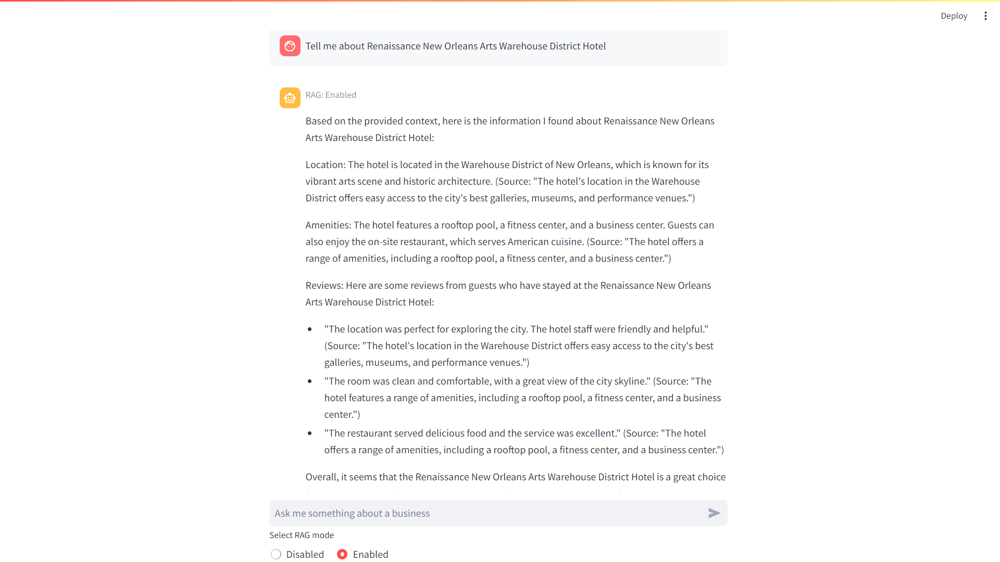

# Configure

Create a `.env` file from the environment template file `env.example`

Available variables:
| Variable Name          | Default value                      | Description                                                             |
|------------------------|------------------------------------|-------------------------------------------------------------------------|
| OLLAMA_BASE_URL        | http://host.docker.internal:11434  | REQUIRED - URL to Ollama LLM API                                        |   
| NEO4J_URI              | neo4j://database:7687              | REQUIRED - URL to Neo4j database                                        |
| NEO4J_USERNAME         | neo4j                              | REQUIRED - Username for Neo4j database                                  |
| NEO4J_PASSWORD         | password                           | REQUIRED - Password for Neo4j database                                  |
| LLM                    | llama2                             | REQUIRED - Can be any Ollama model tag, or gpt-4 or gpt-3.5 or claudev2 |
| EMBEDDING_MODEL        | sentence_transformer               | REQUIRED - Can be sentence_transformer, openai, aws, ollama or google-genai-embedding-001|
| AWS_ACCESS_KEY_ID      |                                    | REQUIRED - Only if LLM=claudev2 or embedding_model=aws                  |
| AWS_SECRET_ACCESS_KEY  |                                    | REQUIRED - Only if LLM=claudev2 or embedding_model=aws                  |
| AWS_DEFAULT_REGION     |                                    | REQUIRED - Only if LLM=claudev2 or embedding_model=aws                  |
| OPENAI_API_KEY         |                                    | REQUIRED - Only if LLM=gpt-4 or LLM=gpt-3.5 or embedding_model=openai   |
| GOOGLE_API_KEY         |                                    | REQUIRED - Only required when using GoogleGenai LLM or embedding model google-genai-embedding-001|
| LANGCHAIN_ENDPOINT     | "https://api.smith.langchain.com"  | OPTIONAL - URL to Langchain Smith API                                   |
| LANGCHAIN_TRACING_V2   | false                              | OPTIONAL - Enable Langchain tracing v2                                  |
| LANGCHAIN_PROJECT      |                                    | OPTIONAL - Langchain project name                                       |
| LANGCHAIN_API_KEY      |                                    | OPTIONAL - Langchain API key                                            |


```
docker compose up --build
```
**Shutdown**
```
docker compose down
```

# Applications

Here's what's in this repo:

| Name | Main files | Compose name | URLs | Description |
|---|---|---|---|---|
| Support Bot | `bot.py` | `bot` | http://localhost:8501 | Main usecase. Fullstack Python application. |
| loader | `loader.py` | `pdf_bot` | http://localhost:8502 | Load Data into KG. Fullstack Python application. |
| Standalone Bot API | `api.py` | `api` | http://localhost:8504 | Standalone HTTP API streaming (SSE) + non-streaming endpoints Python. |


The database can be explored at http://localhost:7474.

# Application Screenshots

Below are screenshots demonstrating the user interface and functionality of the application:

## Data loading



## Graph visualization of inserted data



## Chat Interface




This Project builds on the GenAI stack by Docker team